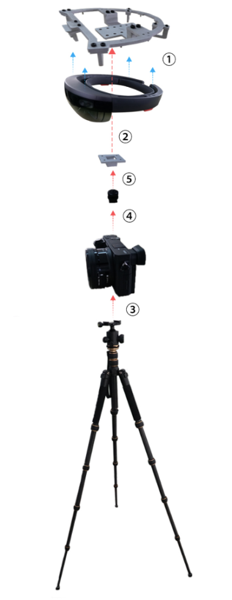

Welcome
=============

MeshExpert Live! is a real-time Mixed-Reality (MR) filming and show
product developed by DataMesh. It is intensively designed on top of
HoloLens, so that mixed-reality could be perceived by more people.
Leveraging on our solution, HoloLens users can see amazing MR images,
while those who do not wear HoloLens can also experience MR scenes
through ME Live! in real-time. Meanwhile, the gap among different
devices of sharing the same MR experiences can be well bridged by
incorporating the collaboration feature offered by ME Live!, where you
could easily interact with mixed realities via all sorts of VR/AR
glasses and even mobiles and tablets, which creates various
possibilities for immersive mixed-reality experiences.

Main Features
=============

-  **Real-time MR Show**

    Our solution supports real-time casting of mixed-reality scenes.
    Through a set of equipment of paired HoloLens and ME-Live!, you can
    immediately cast MR scenes to any screen such that those who do not
    wear HoloLens can also enjoy the fantastic MR show.

-  **4K MR Recording**

    Besides real-time casting, you can record the show with ME-Live! for
    a resolution up to 4K.

-  **Muti-Player & Multi-Device Collaboration**

    Collaborations of teams across devices are made easy with ME-Live!.
    Using our management portal, you can distribute apps and scenes to a
    bunch of HoloLens, which would automatically set them to synchronize
    with one another through ME-Live! workstation. This, therefore,
    enables people to work at the very same scene, and seamlessly
    collaborate with each other, in situations like Training, Gaming,
    Design and Innovation, etc.. Meanwhile, the creative process can be
    captured and cast by ME-Live!, where everything is vividly alive!

-  **Cross-platform Support**

    ME-Live! is widely applicable as it offers a comprehensive
    cross-platform solution. No matter what devices you have: HoloLens,
    Surface, Pad, iPhone, Android Mobile, etc., you can have them
    connected to ME-Live! so that they can share the same scenes of
    mixed reality.

-  **Content Storage & Distribution over Cloud**

    Through the MeshExpert Cloud, your apps and creative contents can be
    easily managed, and distributed to multiple ME-Live! deployments
    across regions. Thus ideas and innovations in your enterprise can
    flow fluently across offices and departments.

-  **Multi-language Voice Interaction**

    ME-Live! adds multi-language voice recognition to HoloLens apps. You
    can customize your own voice commands to enable a more powerful and
    friendly human-machine interactions.

-  **Social Networking and Sharing**

    By connecting to our social cloud services, you can share your
    photos and videos of the captured mixed-reality shows to a wide
    range of social networks such as Facebook, Twitter, Wechat, Weibo,
    etc., either to promote your brand or to amaze your friends.

-  **Developer Support**

    With the aid of the free opensource METoolkit and SDKs, anyone who
    wants to create his/her apps can easily make it work and enjoy the
    powerful features of ME-Live!. All developers can access our
    technical guidance materials, seek help from our forums, and gain
    our technical support.

Quick Installation
==================

Install the RIG
---------------

It's recommended to use RIG kit offered by DataMesh to gain access to
the best experience and convenience. The suite can be easily dissembled
and assembled, but it's required that we should fix the complete set of
device firmly so as to reduce unstable factors , such as shake, when we
use it.

RIG kit offered by DataMesh has been equipped with all necessary
software in advance.

The assembly process of RIG kit is demonstrated in the ":ref:`_fig_rig-assembly`" and steps are as follows:

.. _fig_rig-assembly:

   Rig Assembly Diagram

1. Fix HoloLens on the dedicated fixed mount.

2. Install fixed module of hot shoe of HoloLens's fixed mount on the
   bottom of the fixed mount.

3. Place tripod and fix digital camera on the head of tripod.

4. Fix hot shoe connector on the hot shoe interface of the camera.

5. Connect fixed module of hot shoe of HoloLens's fixed mount to the
   connector and screw it up.

Install the Workstation
-----------------------

It's recommended to use the work station device offered by DataMesh to
gain access to the best experience. The work station device offered by
DataMesh has been equipped with all necessary software in advance.

Steps of access to work station are as follows(see in Picture ":ref:`_fig_rig-workstation-connection-diagram`"):

.. _fig_rig-workstation-connection-diagram:
.. figure:: images/gworkstation-connection-diagram.png
   :width: 500
   :align: center
   :alt: Workstation Connection Diagram
   :figclass: align-center
   
   Workstation Connection Diagram

1. Connect output interface of HDMI of the camera to input interface of
   HDMI of work station's video card by using the HDMI connecting
   wire.(Micro HDMI - HDMI).

2. Connect Micro USB interface of HoloLens to USB3.0 interface of work
   station(optional for the convenience of USB debugging and charging)
   by using USB cable（Micro USB - USB）.

3. Connect Lan interface of work station to that of Router by using
   cable.

4. Connect output interface of HDMI of work station's video card to
   screen on which pictures are required to be displayed by using HDMI
   connecting wire.（HDMI - HDMI）

5. Add Router's Wi-Fi to HoloLens network settings.

Add License
-----------

You need to add a license to activate full corresponding functionalities
of ME-Live! before use.

Open the browser on the ME-Live! workstation (Edge and Chrome are
preferable) to visit *http://localhost/admin*. Note that you need to
install MeshExpert supporting software, the **MeshExpert Suite**, before
adding a license if the workstation is assembled by yourself. As for
installation of MeshExpert Suite, please refer to `User
Guide <https://github.com/DataMesh-OpenSource/MeshExpert-Live/wiki/User-Guide>`__
for ME Live!

Once you opened *http://localhost/admin*, you can upload your license
file via the "Adding License" page as shown below. If you haven't obtain
a license yet, please contact *service@datamesh.com* for a trial or
commercial license.

 Adding License

Upon finished, you will see your license information in the "License"
tab as demonstrated below, which reveals the detailed information about
your licensing.

 License Information

Experience Mixed-Reality
========================

Now everything is ready, you can begin enjoy the amazing mixed-reality
shows with ME-Live!

Start the built-in app **Solar System Explorer**, and you shall see the
whole solar system in front of your naked eyes, which is so vividly that
you can almost touch it with your fingers.

Use your finger to tap a planet to zoom in, and you can observe it with
great details.

Moreover, you can interact with virtual planets with simple gestures:
rotate planets with horizontal drag and zoom planets in and out with
vertical drag.

    NOTE: ME-Live! makes it easy to install, manage, start and stop apps
    on HoloLens. For detailed instructions, please refer to `App
    Management <https://github.com/DataMesh-OpenSource/MeshExpert-Live/wiki/User-Guide#app-management>`__
    in User Guide.
